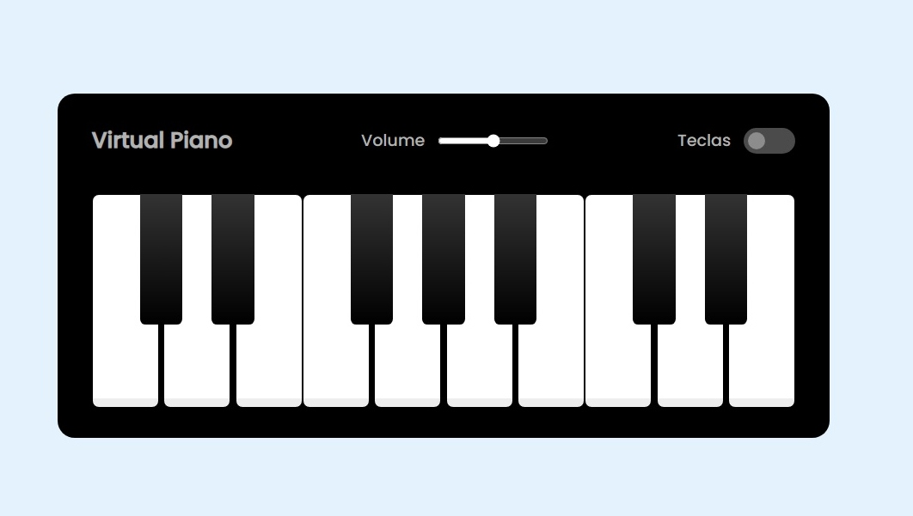

## PIANO VIRTUAL

Piano virtual desenvolvido com html, css e javascript.
Esse piano é uma das atividades do bootcamp Potência Tech iFood - Desenvolvimento de Jogos, ministrado através da Digital Innovation One em parceria com o Ifood.

Ativando a opção teclas, no canto superior direito, aparecem as letras correspondentes no teclado do computador a cada tecla do piano.

Foi um bom projeto para treinar habilidades nas tecnologias usadas. 

Como aprimoramento do projeto eu fiz a correção da escala diatônica do piano.
E além disso eu alterei os nomes dos audios para coincidirem com os nomes das notas musicais, tornando mais fácil uma manutenção futura no código. 

Para acessar o deploy visite o site [Aqui](https://bajan1408.github.io/piano-virtual-js/).